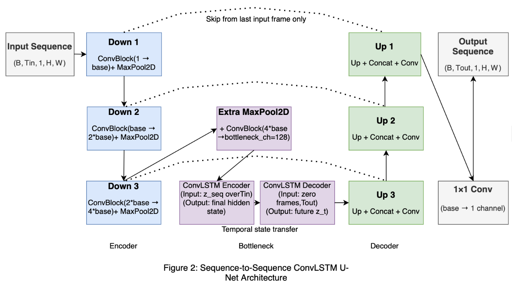
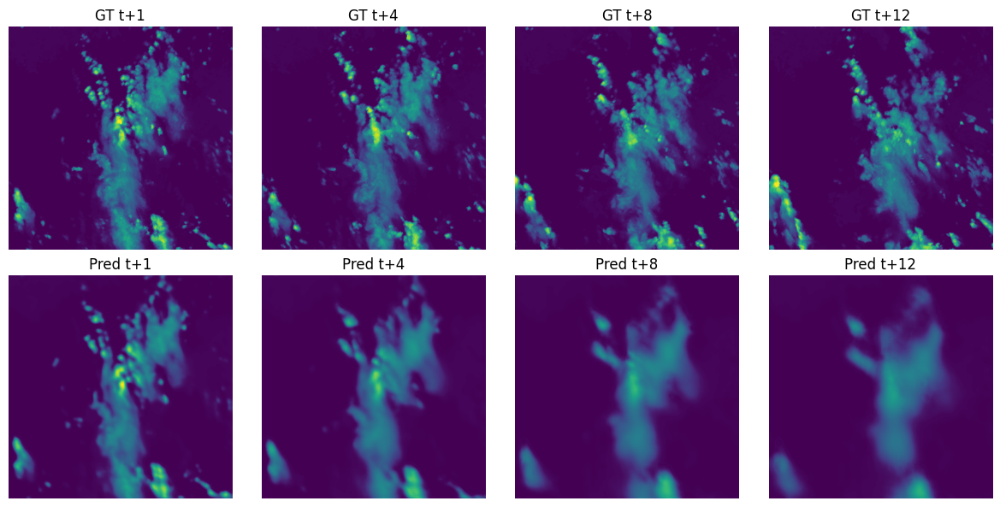
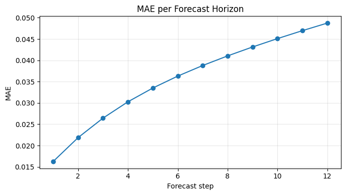

# Storm Forecasting with ConvLSTM Seq2Seq

A clean, reproducible PyTorch refactor of an Imperial College MSc storm forecasting project for **direct multi-step storm nowcasting** on **VIL (Vertically Integrated Liquid)** imagery.

The task is to use **12 past VIL frames** to predict the **next 12 frames** at a **5-minute cadence**. The original coursework objective was to optimise **MAE / L1 loss** because that was the competition metric. This repository preserves that baseline, then restructures the project into a modular research codebase that is easier to inspect, reproduce, extend, and evaluate.

---

## Overview

This project began as a notebook-based coursework and competition entry and is now being refactored into a cleaner ML research repository with:

- modular PyTorch code under `src/`
- reproducible data bootstrap and indexing
- config-driven train / eval / predict workflows
- storm-wise dataset splitting
- saved config and metrics artifacts
- utilities for more careful post-hoc analysis

The immediate goal is to preserve the original competition-aligned baseline honestly, then add better evaluation and analysis around it, including:

- **weighted MAE**
- **SSIM**
- **MC-dropout-based uncertainty proxy**

These are treated as **supplementary evaluation extensions**, not as retroactive rewrites of the original benchmark.

---

## Problem formulation

This is a **direct multi-step spatiotemporal forecasting** problem.

- **Input:** 12 historical VIL frames
- **Output:** 12 future VIL frames
- **Cadence:** 5 minutes per frame
- **Spatial resolution:** 384 × 384
- **Task:** predict all 12 future frames in one forward pass

The original dataset contains multiple modalities, but this project filters to **VIL only** for the Task 1 forecasting setup.

---

## Why this repository exists

The original notebook implementation was enough to complete the coursework and competition, but it mixed together:

- exploratory data analysis
- metadata filtering
- HDF5 I/O
- sliding-window construction
- model definition
- training loops
- evaluation
- plotting and GIF generation

This repository separates those concerns into a proper Python package so the project is easier to:

- review
- rerun
- test
- extend
- present as a portfolio piece for ML research and ML engineering roles

---

## Dataset structure and modelling implications

The dataset structure is important for understanding the design choices.

The final Task 1 setup uses:

- **800 unique storms**
- **36 frames per storm**
- **12 input frames + 12 target frames**
- **stride = 1**
- **13 overlapping windows per storm**
- **10,400 total windows**

However, those 10,400 windows are **not independent samples**. They are heavily overlapping within each storm, so the effective training diversity is much closer to **hundreds of storms** than to a large-scale video forecasting dataset.

That matters for model selection.

This project deliberately does **not** default to a transformer or diffusion-style architecture. Given:

- only **800 unique storms**
- strong overlap between windows
- full-resolution **384 × 384** sequences
- the need for a competitive and stable baseline under coursework constraints

a **ConvLSTM-U-Net** was a more appropriate first model than substantially larger, more data-hungry alternatives trained from scratch.

In other words, the project prioritises **inductive bias and data efficiency** over architectural novelty.

---

## Why direct forecasting instead of autoregressive rollout

Two broad forecasting strategies were considered:

1. **autoregressive rollout**
2. **direct multi-output prediction**

This project uses **direct multi-output forecasting**, predicting all 12 future frames in one forward pass.

That choice was deliberate:

- storm dynamics can change materially across the forecast horizon
- autoregressive rollout compounds error as predictions are fed back into the model
- evaluation is performed over the full multi-step horizon, so direct supervision is a more natural fit
- direct prediction keeps the training target aligned with the actual downstream task

For long-horizon storm evolution, avoiding cumulative rollout drift was an important consideration.

---

## Why MAE / L1 was used originally

The original coursework and competition were scored with **MAE**, so the baseline model was trained with **L1 loss**.

That decision is preserved here for a simple reason: it keeps the benchmark honest.

Rather than retroactively replacing the objective with a more complex perceptual or weighted loss, this repository first reproduces the original setup faithfully. Only after that does it add more nuanced evaluation and analysis.

---

## Planned evaluation extensions

The next stage of the project is not to replace the baseline, but to **interrogate it more carefully**.

### Weighted MAE

Weighted MAE is used as a supplementary metric to test whether plain MAE under-emphasises **rare high-intensity storm regions**. In the current setup, this is implemented as an intensity-aware error reweighting rather than a replacement training objective.

### SSIM

SSIM is used as a **structural fidelity metric** to detect whether forecasts become overly smooth or lose storm morphology even when pixelwise error remains acceptable.

### MC dropout

A lightweight **MC-dropout uncertainty proxy** remains a planned extension for future work. It is intended as an exploratory uncertainty signal, not as a calibrated probabilistic forecast.

---

## Model architecture

The final model is a **sequence-to-sequence ConvLSTM U-Net**:

- encoder: spatial downsampling via convolutional blocks
- bottleneck: ConvLSTM encoder-decoder for temporal state transfer
- decoder: upsampling path with skip connections
- output: direct prediction of the full future sequence



This architecture was chosen because it combines:

- **temporal memory** from ConvLSTM
- **multi-scale spatial reconstruction** from U-Net
- a better compute/performance trade-off than larger sequence models for this dataset regime

---

## Repository layout

```text
storm-forecasting-convlstm/
├─ configs/
├─ data/
├─ docs/
├─ notebooks/
├─ outputs/
├─ reports/
├─ scripts/
├─ src/storm_forecasting/
└─ tests/
```

### Main package structure

```text
src/storm_forecasting/
├─ cli/            # train / evaluate / predict / dataset index commands
├─ data/           # HDF5 I/O, indexing, splits, datasets, windowing
├─ evaluation/     # metrics, horizon analysis, qualitative tools, uncertainty
├─ models/         # ConvLSTM, U-Net blocks, seq2seq architecture
├─ training/       # losses, optimisation, engine, checkpoints
├─ utils/          # device and logging helpers
├─ config.py       # hierarchical config loading
├─ paths.py
└─ seed.py
```

---

## What is implemented

- HDF5 loading for per-storm VIL arrays
- sliding-window sequence generation
- storm-wise train/val/test split
- lazy PyTorch dataset
- ConvLSTM bottleneck U-Net seq2seq model
- MAE baseline training
- overall MAE / MSE / RMSE evaluation
- per-horizon error curves
- qualitative panels and GIF generation
- optional weighted MAE / SSIM / MC dropout utilities
- reproducible data bootstrap from Hugging Face
- resolved config export to YAML / CSV for train and eval runs

---

## Installation

Create and activate a virtual environment:

```bash
python -m venv .venv
source .venv/bin/activate
pip install -e ".[dev]"
pre-commit install
```

This installs both runtime and development dependencies, including:

- PyTorch
- pandas / NumPy / matplotlib
- h5py
- scikit-learn
- pytest
- ruff
- pre-commit

---

## Data bootstrap

The raw coursework dataset is hosted on Hugging Face and requires authentication.

### Option 1: environment variable

```bash
export HF_TOKEN="your_token_here"
```

### Option 2: Hugging Face CLI login

```bash
huggingface-cli login
```

Then bootstrap the raw data and build the VIL-only index:

```bash
make download-data
```

or:

```bash
./scripts/bootstrap_data.sh
```

This downloads or reuses cached copies of:

- `data/events.csv`
- `data/train.h5`

and builds:

- `data/vil_events.csv`

No raw data or secrets are committed to the repository.

---

## Core commands

### Build the VIL-only index

```bash
python -m storm_forecasting.cli.make_dataset_index \
  --config configs/experiments/baseline_reproduction.yaml \
  --download
```

### Train the main desktop baseline

```bash
python -m storm_forecasting.cli.train \
  --config configs/experiments/baseline_desktop.yaml \
  --device cuda \
  --num-workers 2 \
  --batch-size 1 \
  --save-config-artifacts
```

### Evaluate the main desktop baseline

```bash
python -m storm_forecasting.cli.evaluate \
  --config configs/experiments/baseline_desktop.yaml \
  --checkpoint outputs/checkpoints/baseline_desktop/best.pt \
  --device cuda \
  --num-workers 2 \
  --batch-size 1 \
  --save-config-artifacts
```

### Evaluate supplementary metrics on the same checkpoint

```bash
python -m storm_forecasting.cli.evaluate \
  --config configs/experiments/weighted_mae_eval.yaml \
  --checkpoint outputs/checkpoints/baseline_desktop/best.pt \
  --device cuda \
  --num-workers 2 \
  --batch-size 1 \
  --save-config-artifacts
```

### Predict qualitative examples

```bash
python -m storm_forecasting.cli.predict \
  --config configs/experiments/baseline_desktop.yaml \
  --checkpoint outputs/checkpoints/baseline_desktop/best.pt \
  --split test \
  --index 0
```

---

## Useful CLI arguments

### `storm_forecasting.cli.make_dataset_index`

- `--config` — load paths and dataset metadata from a config
- `--download` — download raw files before building the index
- `--repo-id` — override the Hugging Face dataset repo
- `--local-dir` — override the download location
- `--events-csv` — explicit path to raw metadata CSV
- `--output-csv` — explicit path to the generated VIL-only index
- `--img-type-col` — override the modality column used for filtering
- `--vil-value` — override the value treated as VIL

### `storm_forecasting.cli.train`

- `--config` — experiment config
- `--device` — override device selection, e.g. `cpu` or `cuda`
- `--num-workers` — dataloader worker override
- `--batch-size` — dataloader batch-size override
- `--save-config-artifacts` — save the fully resolved config as YAML and a flattened CSV table

### `storm_forecasting.cli.evaluate`

- `--config` — experiment config
- `--checkpoint` — checkpoint to evaluate
- `--device` — override device selection
- `--num-workers` — dataloader worker override
- `--batch-size` — dataloader batch-size override
- `--max-batches` — smoke-test the evaluation loop on a small subset
- `--save-config-artifacts` — save the fully resolved config as YAML and a flattened CSV table

### `storm_forecasting.cli.predict`

- `--config` — experiment config
- `--checkpoint` — checkpoint to load
- `--split` — dataset split to sample from
- `--index` — dataset sample index to visualise
- `--device` — override device selection

---

## Outputs and reproducibility

Training and evaluation can save:

- resolved config YAML files
- flattened config CSV tables
- JSON metric summaries
- CSV metric summaries
- per-horizon MAE CSV files
- qualitative figures under `outputs/figures/`
- prediction artifacts under `outputs/predictions/`

This makes experiments easier to inspect and compare without depending on notebook state.

---

## Results

The main baseline in this repository is the **storm-wise train/validation/test split** run produced by the refactored codebase.

Training summary:
- best validation checkpoint at **epoch 8**
- **best validation MAE:** 0.0379
- learning rate reduced from `1e-4` to `5e-5`
- early stopping triggered after the validation metric plateaued

Held-out test performance of the selected checkpoint:
- **MAE:** 0.0357
- **MSE:** 0.00694
- **RMSE:** 0.0789

Supplementary evaluation on the same checkpoint:
- **weighted MAE:** 0.0507
- **SSIM:** 0.7344

These results establish a clean, reproducible baseline before any loss-function changes or uncertainty extensions.





### Interpretation

The baseline generalises reasonably well on held-out storms, but the qualitative examples show a consistent failure mode: predictions become progressively **smoother and less spatially sharp** as lead time increases. This matches the gap between standard MAE and intensity-weighted MAE, and it is exactly why structural and intensity-aware evaluation were added. SSIM provides a complementary view of morphological fidelity, while weighted MAE makes errors on stronger storm regions count more heavily.

The original competition result was:

- **2nd place out of 25 teams** across Imperial ACSE and EDSML

That ranking reflects the original coursework setup. This repository reframes the project as a reproducible research-engineering baseline rather than trying to rewrite the competition outcome after the fact.

---

## Notebooks

The notebooks now play a narrower role than in the original coursework.

- `01_eda.ipynb` — metadata inspection and task framing
- `02_error_analysis.ipynb` — saved-metric analysis and horizon-wise evaluation
- `03_qualitative_results.ipynb` — panels, GIFs, and interpretation

Core training and evaluation logic lives in `src/`, not in notebook cells.

---

## What this project does **not** claim

This repository should not be framed as:

- an operational forecasting platform
- a production geospatial MLOps system
- a calibrated probabilistic weather service
- a full remote sensing stack

It is a clean **research-engineering refactor** of a spatiotemporal forecasting project using VIL imagery in PyTorch.

---

## Future work

- compare the desktop baseline against the strict coursework-style reproduction run
- investigate weighted-MAE training only after the current baseline is fixed as the reference point
- test SSIM-informed objectives carefully rather than treating SSIM as a replacement benchmark
- add a lightweight MC-dropout uncertainty notebook for qualitative uncertainty maps
- keep the repo focused on reproducible forecasting experiments rather than turning it into a generic MLOps showcase

---

## Quickstart

```bash
python -m venv .venv
source .venv/bin/activate
pip install -e ".[dev]"
export HF_TOKEN="your_token_here"
make download-data
pytest
python -m storm_forecasting.cli.train \
  --config configs/experiments/baseline_desktop.yaml \
  --device cuda \
  --num-workers 2 \
  --batch-size 1 \
  --save-config-artifacts
python -m storm_forecasting.cli.evaluate \
  --config configs/experiments/weighted_mae_eval.yaml \
  --checkpoint outputs/checkpoints/baseline_desktop/best.pt \
  --device cuda \
  --num-workers 2 \
  --batch-size 1 \
  --save-config-artifacts
```

---

## Acknowledgements

This repository is based on an Imperial College MSc storm forecasting coursework project and competition entry, then refactored into a cleaner and more reproducible research codebase.
